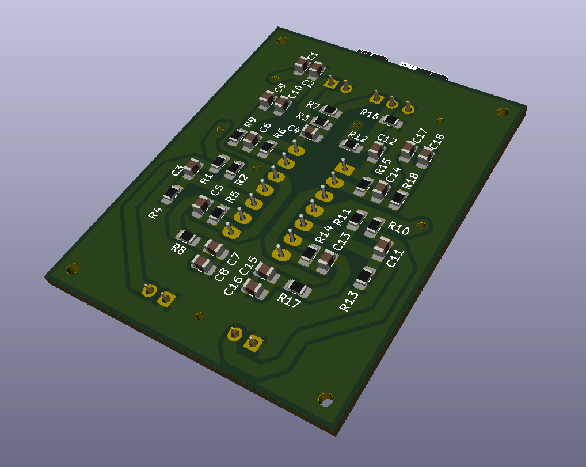

# AudioLocator
Urządzenie umożliwiające wykrycie kierunku nadchodzącego dźwięku o znanych parametrach (sinusoidlany, o znanej częstotliwość).

Urządzenie składa się z:
* dwóch mikrofonów
* dwóch wzmacniaczy mikrofonowych 
* mikrokontroler STM32.

Mikrokontroler na podstawie dźwięku przechwyconego mikrofonami, oblicza kierunek z którego nadchodzi dźwięk.

Docelowo urządzenie ma zostać wyposarzone w dodatkowe mikrofony i umożłiwiać wykrywanie pozycji 3D źródła dźwięku.

## Model pytki PCB ze wzmacniaczami mikrofonowymi:

